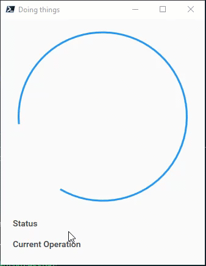

[](https://tiberriver256.visualstudio.com/be77c668-1e13-4360-aa08-264b1d5f64c6/_boards/board/t/37c8e3a8-220a-47b9-8b2f-13dd17f11c6d/Microsoft.RequirementCategory)
# PoshProgressBar
A PowerShell ProgressBar in XAML using Material Design in XAML Toolkit from ButchersBoy

## Sample usage

```pwsh
$progressBar = New-ProgressBar -IsIndeterminate $true -MaterialDesign -Type Circle
Write-ProgressBar -Activity "Doing things" -ProgressBar $progressBar -Status "Status" -CurrentOperation "Current Operation"
```

Result:



## [The Website](https://tiberriver256.github.io/PoshProgressBar/ "The Website")

The website has a little utility that will help you pick your available options

## TODO

1. Automated Screenshots for documentation
2. Backwards compatibility and ??Server 2012 Compatibility??
3. Closing progressbar shrinks it to notification tray
4. Branding (.ico, Banner, Background)
5. Add MahApps styling


## Contribution Guidelines

Nothing too formal.

1. Find an issue / feature reqeust or create your own [here](https://github.com/Tiberriver256/PoshProgressBar/issues)
2. Assign it to yourself
3. Fork it
4. Code it
5. Submit the pull request to the **Development** branch.
6. I'll verify with testing everything looks good and then merge it with the master, and add it to the PowerShell Gallery
