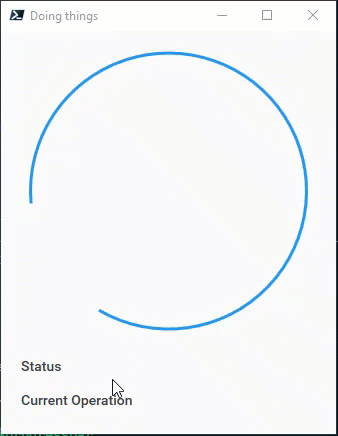

# PoshProgressBar

A PowerShell progress bar in XAML using the Material Design in XAML Toolkit.

## Install

```powershell
Install-Module PoshProgressBar -Scope CurrentUser
Import-Module PoshProgressBar
```

## Compatibility

> **Windows only.** Requires **Windows PowerShell 5.1+** with WPF
> (`PresentationFramework`, .NET Framework 4.x). Not supported on Linux, macOS,
> or PowerShell 7+ (the vendored Material Design assemblies target .NET
> Framework 4.0 — see [THIRD-PARTY-NOTICES.md](./THIRD-PARTY-NOTICES.md)).

## Sample usage

```powershell
$progressBar = New-ProgressBar -IsIndeterminate $true -MaterialDesign -Type Circle
Write-ProgressBar -Activity "Doing things" -ProgressBar $progressBar -Status "Status" -CurrentOperation "Current Operation"
# ...
Close-ProgressBar -ProgressBar $progressBar
```

Result:



With window options (see [CHANGELOG.md](./CHANGELOG.md)):

```powershell
$progressBar = New-ProgressBar -MaterialDesign -Type Horizontal `
    -Topmost $true -ResizeMode NoResize -ShowInTaskbar $true `
    -PicturePath "C:\Images\logo.png"
```

## Documentation

- Full per-command help with examples: [`PoshProgressBar/PoshProgressBar.psm1-help.xml`](./PoshProgressBar/PoshProgressBar.psm1-help.xml)
- Changes: [CHANGELOG.md](./CHANGELOG.md)
- Vendored dependency provenance: [THIRD-PARTY-NOTICES.md](./THIRD-PARTY-NOTICES.md)
- Companion site with an option picker: <https://tiberriver256.github.io/PoshProgressBar/>

## Roadmap

Tracked as GitHub issues ([all open issues](https://github.com/Tiberriver256/PoshProgressBar/issues)):

1. Automated screenshots for documentation
2. Backwards compatibility / Server 2012 verification
3. Branding (icon, banner, background)
4. MahApps styling
5. NuGet-based MaterialDesign dependency instead of vendored DLLs

## Contributing

1. Find or open an [issue](https://github.com/Tiberriver256/PoshProgressBar/issues) and assign it to yourself.
2. Fork, branch from `Development`, and add Pester coverage for behavior changes.
3. `Invoke-ScriptAnalyzer -Path ./PoshProgressBar -Settings ./PSScriptAnalyzerSettings.psd1` must be clean.
4. Open a pull request against the **Development** branch. CI runs Pester + PSScriptAnalyzer on Windows.

## License

MIT — see [LICENSE.md](./LICENSE.md). Third-party binaries are covered in [THIRD-PARTY-NOTICES.md](./THIRD-PARTY-NOTICES.md).
